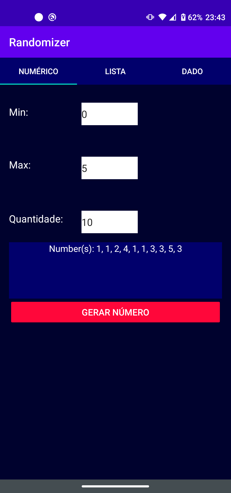
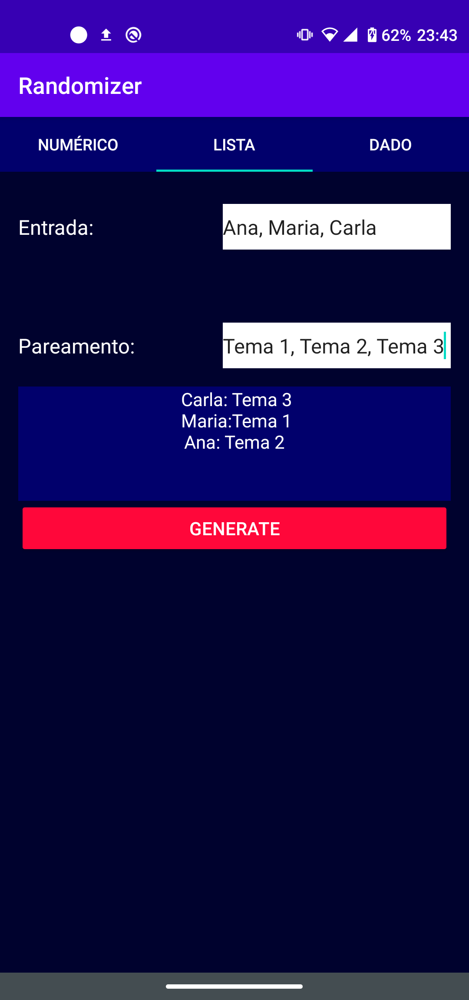
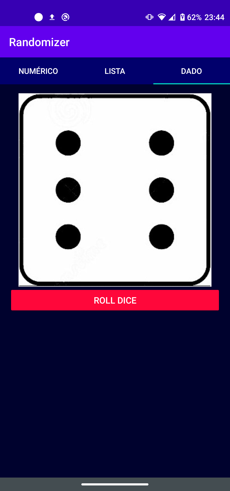

Randomizer é um aplicativo randomização de números e até listas, há também como jogar um dado.

A primeira aba que aparece por padrão ao executar o App randomiza um número ou uma sequência dependendo
da quantidade informada em "Quantidade" bastando clicar no botão "Gerar".

A segunda aba é responsável por combinar 2 listas de mesmo tamanho de forma aleatória bastando clicar
no botão "Gerar".

A terceira aba é responsável por jogar um dado e mostrar o valor obtido de forma visual bastando clicar
no botão "Jogar Dado".
